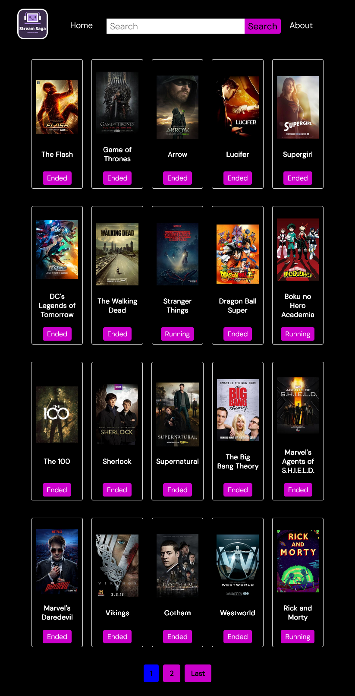

# Stream Saga Web App

## Description

Stream Saga is a web application that allows users to explore and keep track of their favorite TV shows and episodes. Users can search for shows, and mark the episodes they have watched. The application provides a user-friendly interface and a streamlined experience for managing TV show consumption.

## Features

- Search functionality: Search for TV shows to discover their details.
- Show listing: View a list of popular TV shows with images and details.
- Episode tracking: Mark episodes as watched to keep track of your progress.

## Tech Stack

- Frontend: React, React Router, CSS, Vite
- API Integration: Consuming data from the [Episodate API](https://www.episodate.com/api)

## Getting Started

``bash
git clone https://github.com/Detopall/stream-saga.git

cd stream-saga

npm install

npm run dev
``

``Using Vite you can access the application at http://localhost:5173/``

## Screenshots

**still working on this section**

